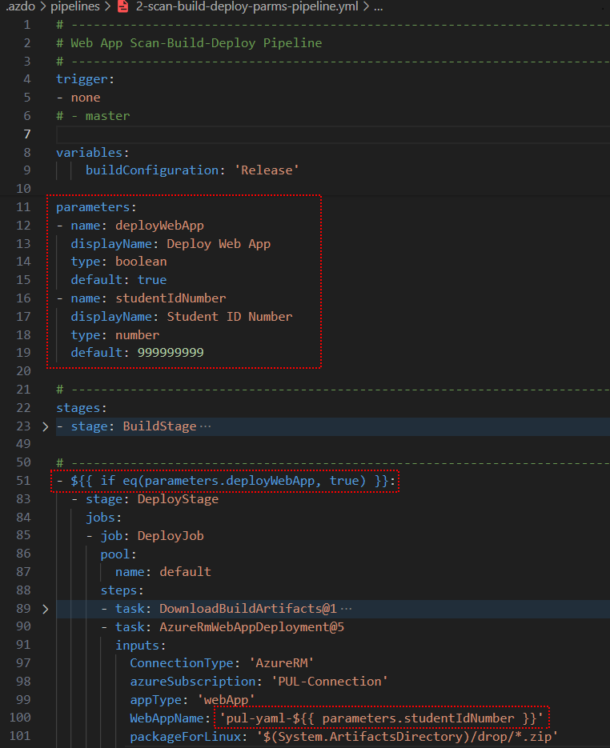
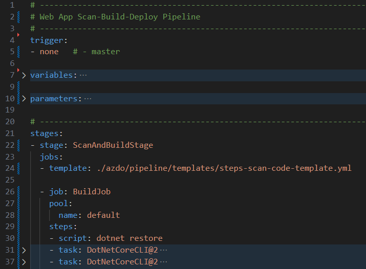
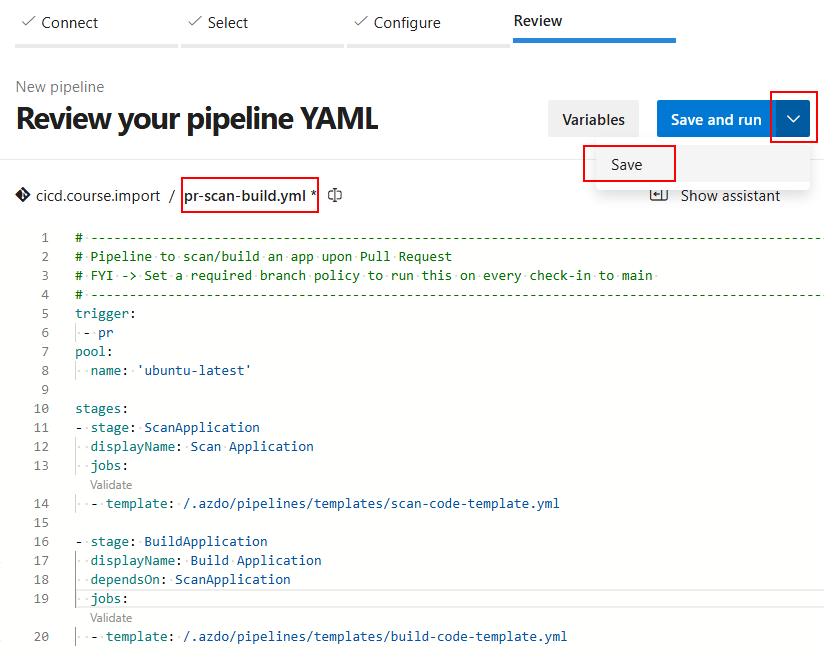
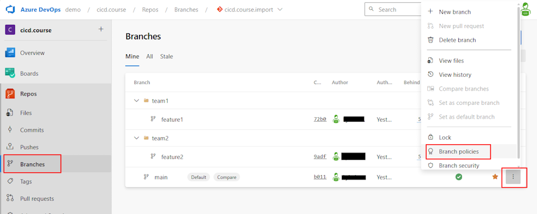
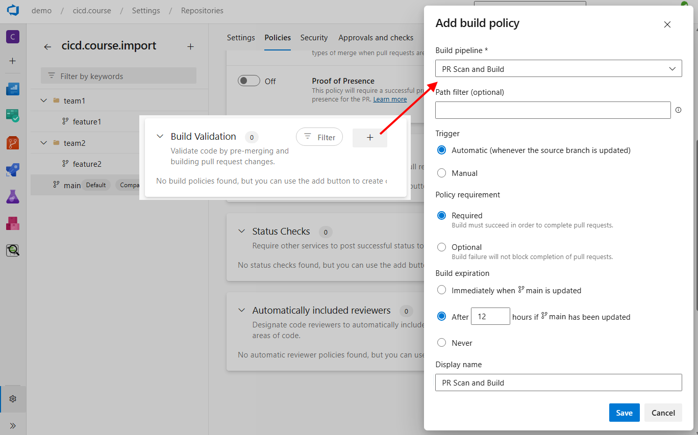
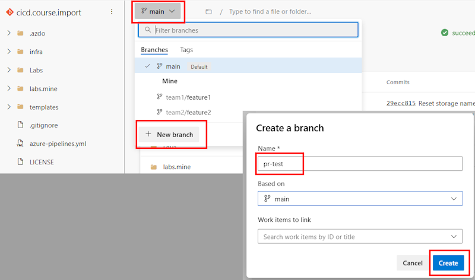
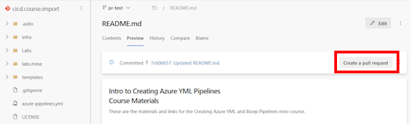
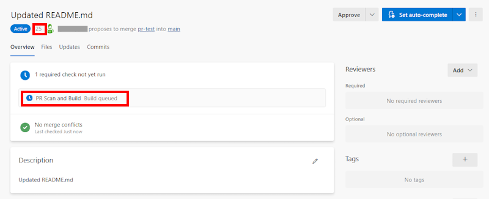
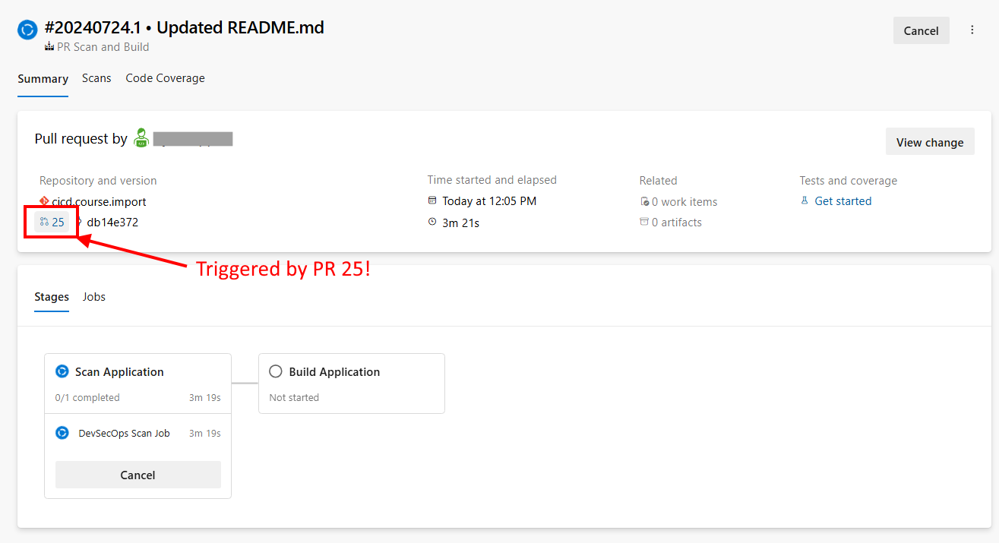
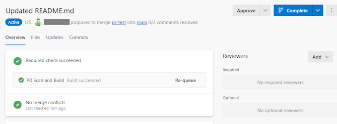

# Azure DevOps Essentials: Module 4 – Additional YML Pipeline Labs

These are additional labs for the Azure DevOps Essentials class that you can use to practice your YML skills.  Do Lab 1 on the VM first to ensure that you have the correct environment set up.

---

## Lab 2 - Add a Run-Time Parameter to the Pipeline

In this lab, you will add a run-time parameter to ask the user whether or not they want to actually deploy the app to Azure.

### Task 2.1: Add a run-time parameter to the pipeline

Insert the following code at the top of the `azure-pipelines.yml` file, right after the `trigger` section.  Change the default value of `999999999` to your student ID number.

``` yaml
parameters:
- name: deployWebApp
  displayName: Deploy Web App
  type: boolean
  default: true
- name: studentIdNumber
  displayName: Student ID Number
  type: number
  default: 999999999
```

---

### Task 2.2: Add a condition to the Deploy stage

Insert this code right before the `stage: DeployStage` statement:

``` yaml
- ${{ if eq(parameters.deployWebApp, true) }}:
```

Remember that YML is indentation-sensitive, so make sure to indent all of the `DeployStage` statements that follow one level by highlighting them and pressing the TAB key.

---

### Task 2.3: Make the Student ID Number a variable

IN the `task: AzureRmWebAppDeployment@5` task, change the `WebAppName` section to look like the following.  This will use the `studentIdNumber` parameter to create a unique name for the web app.

``` yaml
WebAppName: 'pul-yaml-${{ parameters.studentIdNumber }}'
```

If you want, you can change the trigger to be `none` so that it does not run automatically when you push changes to the repo.  This is not required, but it will make it easier to test your changes.

When you are done, it should look something like this:



---

### Run the Pipeline

Now when you run the pipeline manually, the user will be prompted to select whether or not you want to deploy the app to Azure.


---

## Lab 3 - Add a Code Scan to the Pipeline

### Task 3.1: Add a Code Scan Section

Insert this code before the “stage: build” line – this will create a new stage for scanning your source code

``` yaml
- stage: ScanStage
  jobs:
  - template: ./azdo/pipelines/templates/steps/scan-code-template.yml
```

When you click `Validate and Save`, you may get this error if you haven’t installed the extension yet:


---

### Task 3.2: Install the Microsoft Security DevOps Extension

To install a new Extensions, go to the Org Settings – Extensions tab and click on the “Browse Marketplace” button.


Search for Microsoft Security DevOps


Install this in your org by clicking on the “Get if Free” button


And then install it in your org by clicking on the `Install` button.


Repeat this procedure and install the “Code Search” and “SARIF SAST Scans Tab” as well while you are in the marketplace.


---

### Task 3.3: Run the Pipeline

Run this pipeline and you should see three tasks running and completing now.  The scan job may have warnings, but it has been set to continue even if there is an error, so don't worry about that.


---

## Lab 4 - Combine the Build and Scan Jobs

In this lab, you will combine the Build and Scan into one Job.

- Rename the `stage: ScanStage` to be `stage: ScanAndBuildStage`

- Remove the `stage: BuildStage` line and the following `jobs:` line.

Be sure that the indentation is correct.  The `jobs:` line should be indented to the same level as the previous `template:` line.

Your code should look like this:



Run the job again and you can see that now there are two stages instead of three.

---

## Lab 5 - Use Templates in the Pipeline

In this lab, we will change the pipeline to use templates for all of the actions.

---

### Task 5.1: Add a Name to the Pipeline

You can make the name that is displayed in the Azure DevOps pipeline pages more meaningful by adding a custom name to the pipeline.  This is done by adding a `name` property to the pipeline. This name can include variables like the date or the build number.  Add this line at the top of your pipeline.

``` yaml
name: $(date:yyyy).$(date:MM).$(date:dd)$(rev:.r)
```

---

### Task 5.2: Add a Scan Parameter

Add another parameter to the pipeline to choose whether to perform the scan or not.

``` yaml
- name: runCodeScan
  displayName: Run Code Scan
  type: boolean
  default: true
```

Add a conditional statement before the scan stage, making sure to indent it correctly.

``` yaml
- ${{ if eq(parameters.runCodeScan, true) }}:
```

---

### Task 5.3: Create a Build Stage with a template

Replace all of the build stage code with a simple call to a build template.  

> Note: you may have to adjust the path to the template to match where you saved it.

``` yaml
- stage: BuildStage
  jobs:
  - template: ./.azdo/pipelines/templates/steps/build-template.yml
```

---

### Task 5.4: Create a Deploy Stage with a template and a parameter

Replace all of the deploy code with a template and add a parameter for the student number.  Keep the conditional statement for the deploy stage.

> Note: you may have to adjust the path to the template to match where you saved it.

``` yaml
- ${{ if eq(parameters.deployWebApp, true) }}:
  - stage: DeployStage
    jobs:
    - template: ./.azdo/pipelines/templates/steps/deploy-template.yml
      parameters:
        appName:  'pul-yaml-${{ parameters.studentIdNumber }}'
```

---

### Task 5.4: Give it a test

Run the pipeline and verify that it works as expected.

---

## Lab 6 - Create a Pull Request Pipeline

In this lab, we will create the pipeline that can be used whenever a Pull Request is created.  This pipeline will be used to build and scan the code.

---

### Task 6.1: Create a new pipeline file

1. Goto Pipelines -> Pipelines -> New pipeline
1. Select `Azure Repos Git (YAML)`
1. Select your repository
1. Select `Starter Pipeline`

### Task 6.2: Add the appropriate steps to the file

Replace the code provided with the following.  

> Note: you may have to adjust the path to the template to match where you saved it.

``` yaml
# ----------------------------------------------------------------------------------------------------
# Pipeline to Scan and Build Code for a PR
# ----------------------------------------------------------------------------------------------------
name: $(date:yyyy).$(date:MM).$(date:dd)$(rev:.r)

# ----------------------------------------------------------------------------------------------------
# FYI -> Set a required branch policy to run this on every check to main 
# ----------------------------------------------------------------------------------------------------
pr:
- master

# ----------------------------------------------------------------------------------------------------
stages:
jobs:
- stage: ScanApplication
  displayName: Scan Application
  jobs:
  - template: ./.azdo/pipelines/templates/steps/scan-code-template.yml

# ----------------------------------------------------------------------------------------------------
- stage: BuildApplication
  displayName: Build Application
  dependsOn: ScanApplication
  jobs:
  - template: ./.azdo/pipelines/templates/steps/build-template.yml
```

---

### Task 6.3: Register your new pipeline

Click into the file name field and change the name of the file to be saved to `pr-scan-build.yml`, then click on the More options button and select `Save` and commit this to your main branch.

Once the file is saved, use the "More" option in the upper right to rename the pipeline to be `PR Scan and Build`.



Next, in order to get this to run whenever a pull request is created, we have to create a branch policy.  Navigate to Repos -> Branches and select the main branch.  Click on the three dots and select `Branch policies`.



Find the Build Validation section and click on `+` to add a new build policy. Select the pipeline we just created, update the Display name, and click `Save`.



That's it!  Now let's create a PR and have the results show up in the PR.
First we will create a branch to work with.

1. Goto Repos -> Branches
1. Click `New branch`
1. Give it a suitable name for example `pr-test`
1. Click `Create`

    

Next we will edit a file in this branch and create a pull request.

1. Goto Repos > Files
1. Select one of the feature branch you created above for example **pr-test**
1. Click on a file like `readme.md` and then click on the `Edit` button.
1. Make a change to the file, then click on `Commit` and then `Commit` again.

You should see a prompt to create a new pull request.  Click on `Create pull request` then click on `Create`.
    

Once you've saved the PR, you should the pipeline being incorporated into the pull request as one of the requirements.
    

If you were to go over to the pipeline and view the details, you should be able to see that this pipeline was triggered by a PR.
    

Once the pipeline has completed, you should see the results in the PR now!



---

That's it!  You have successfully completed all of the additional YML labs for this course - congratulations!
