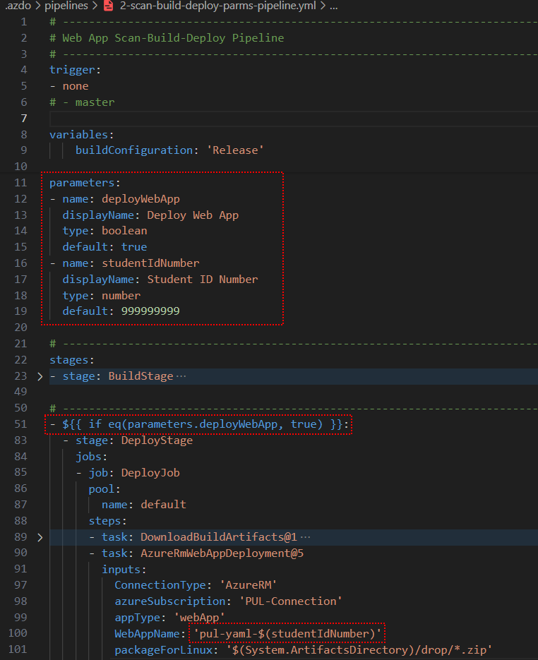
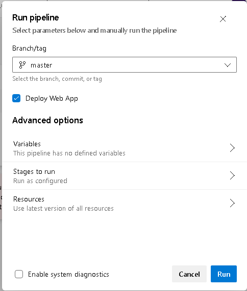

# Azure DevOps Essentials: Module 4 – Additional Labs

## Lab 2 - Add a Run-Time Parameter to the Pipeline

In this lab, you will add a run-time parameter to ask the user whether or not they want to actually deploy the app to Azure.

### Task 1: Add a run-time parameter to the pipeline

Insert the following code at the top of the `azure-pipelines.yml` file, right after the `trigger` section.  Change the default value of `999999999` to your student ID number.

``` yaml
parameters:
- name: deployWebApp
  displayName: Deploy Web App
  type: boolean
  default: true
- name: studentIdNumber
  displayName: Student ID Number
  type: number
  default: 999999999
```

---

### Task 2: Add a condition to the Deploy stage

Insert this code right before the `stage: DeployStage` statement:

``` yaml
- ${{ if eq(parameters.deployWebApp, true) }}:
```

Remember that YML is indentation-sensitive, so make sure to indent all of the `DeployStage` statements that follow one level by highlighting them and pressing the TAB key.

---

### Task 3: Make the Student ID Number a variable

IN the `task: AzureRmWebAppDeployment@5` task, change the `WebAppName` section to look like the following.  This will use the `studentIdNumber` parameter to create a unique name for the web app.

``` yaml
WebAppName: 'pul-yaml-${{ parameters.studentIdNumber }}'
```

If you want, you can change the trigger to be `none` so that it does not run automatically when you push changes to the repo.  This is not required, but it will make it easier to test your changes.

When you are done, it should look something like this:



---

### Run the Pipeline

Now when you run the pipeline manually, the user will be prompted to select whether or not you want to deploy the app to Azure.



---

[Table of Contents](./README.md) | [Next Lab](./Module4-Lab-03.md)
