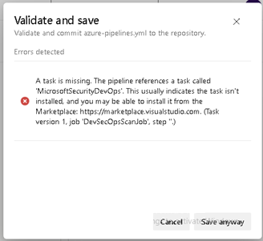
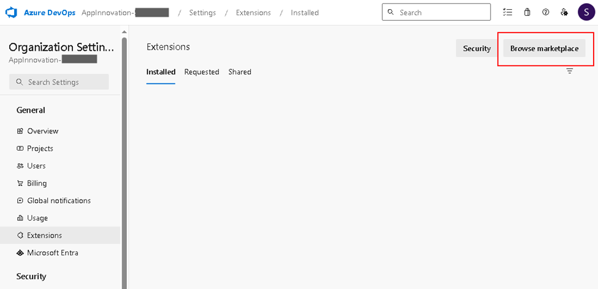
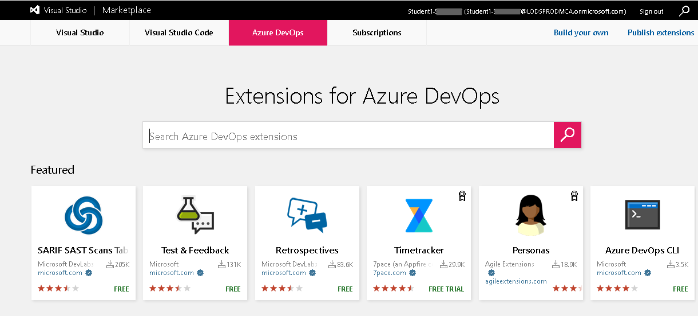
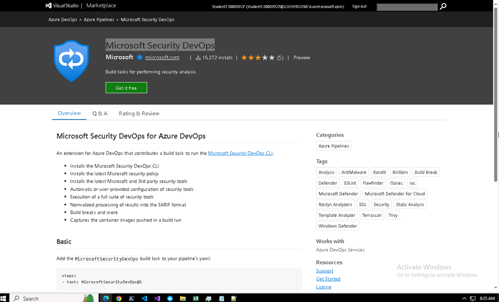
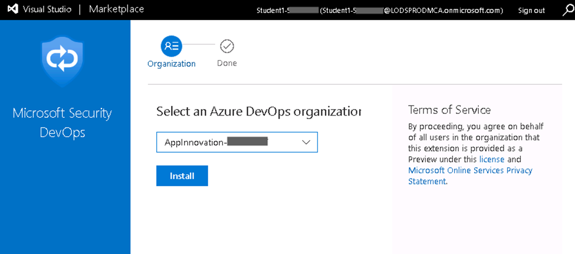
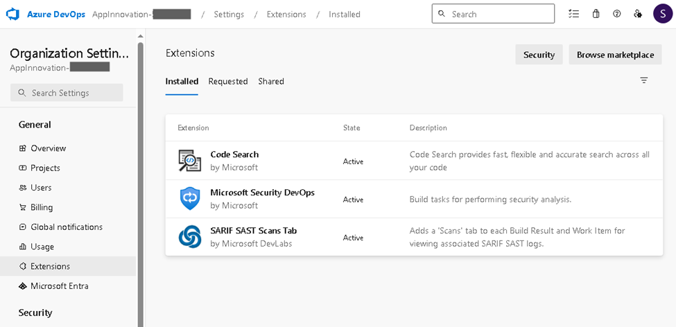
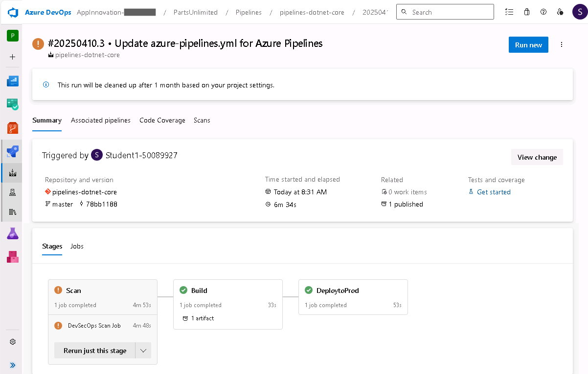

# Azure DevOps Essentials: Module 4 – Additional Labs

## Lab 3 - Add a Code Scan to the Pipeline

### Task 1: Add a Code Scan Section

Insert this code before the “stage: build” line – this will create a new stage for scanning your source code

``` yaml
- stage: ScanStage
  jobs:
  - template: ./azdo/pipeline/templates/steps-scan-code-template.yml
```

When you click `Validate and Save`, you may get this error if you haven’t installed the extension yet:



---

### Task 2: Install the Microsoft Security DevOps Extension

To install a new Extensions, go to the Org Settings – Extensions tab and click on the “Browse Marketplace” button.



Search for Microsoft Security DevOps



Install this in your org by clicking on the “Get if Free” button



And then install it in your org by clicking on the `Install` button.



Repeat this procedure and install the “Code Search” and “SARIF SAST Scans Tab” as well while you are in the marketplace.



---

### Task 3: Run the Pipeline

Run this pipeline and you should see three tasks running and completing now.  The scan job may have warnings, but it has been set to continue even if there is an error, so don't worry about that.



---

[Table of Contents](./README.md) | [Next Lab](./Module4-Lab-04.md) | [Previous Lab](./Module4-Lab-02.md)
